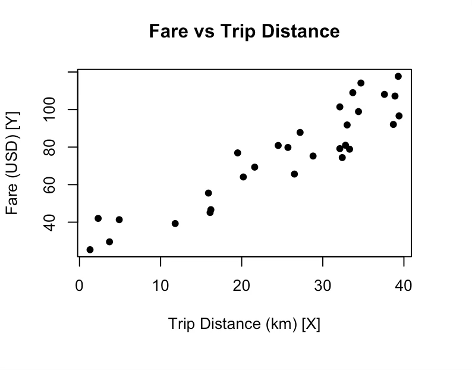

# Taxi-Fare-Regression-Analysis
Statistical modeling and taxi fare prediction using Simple and Multiple Linear Regression in R.

A regression analysis project that models and predicts taxi fares from trip-related attributes. Two approaches are presented:

1. **Simple Linear Regression (SLR)** — `Trip_Distance_km` as the sole predictor of `Fare_USD`, calculated manually (scatter plot, correlation, model fitting).
2. **Multiple Linear Regression (MLR)** — four predictors (`Trip_Distance_km`, `Waiting_Time_min`, `Night_Ride`, `Passenger_Count`), fit in R.

## Dataset Overview

30 taxi ride records with the following variables:

| Variable | Role | Type | Description |
|---|---|---|---|
| `Fare_USD` | Response (Y) | Continuous | Total fare charged in US dollars |
| `Trip_Distance_km` | X1 / X in SLR | Continuous | Distance of the trip in kilometres |
| `Waiting_Time_min` | X2 | Continuous | Total waiting time in minutes |
| `Night_Ride` | X3 | Binary (0/1) | 1 = night ride, 0 = day ride |
| `Passenger_Count` | X4 | Discrete | Number of passengers (1–5) |

## 1. Simple Linear Regression (Manual)

### 1.1 Scatter Plot
`Fare_USD` vs `Trip_Distance_km` was plotted to visually inspect the relationship between the two variables.



### 1.2 Correlation Coefficient (Manual Calculation)

Using `n = 30`, `ΣX = 758.6`, `ΣY = 2275`, `ΣX² ≈ 23174.46`, `ΣY² ≈ 192093.5`, `ΣXY ≈ 65678.65`:

- Mean of X: `X̄ = 758.6 / 30 = 25.2867`
- Mean of Y: `Ȳ = 2275 / 30 = 75.8333`

$$r_{xy} = \frac{\Sigma(X-\bar X)(Y-\bar Y)}{\sqrt{\Sigma(X-\bar X)^2 \cdot \Sigma(Y-\bar Y)^2}} = \frac{8151.482333}{\sqrt{3991.994667 \times 19572.64827}} = 0.92$$

### 1.3 Fitting the Simple Linear Regression Model

**Step 1 — Slope (b):**
$$b = \frac{\Sigma(X-\bar X)(Y-\bar Y)}{\Sigma(X-\bar X)^2} = \frac{8151.482333}{3991.994667} = 2.04$$

**Step 2 — Intercept (a):**
$$a = \bar Y - (b \times \bar X) = 75.8333 - (2.04 \times 25.2867) = 24.248$$

**Step 3 — Fitted equation:**

> **Ŷ = 24.248 + 2.04X**

### 1.4 Interpretation of Results

- **Correlation (r = 0.92):** A very strong positive relationship between trip distance and taxi fare — as distance increases, fare increases, and vice versa.
- **Slope (b = 2.04):** For every extra 1 km travelled, the fare increases by about $2.04 — the per-kilometre rate charged by the company.
- **Intercept (a = 24.248):** The base fare of a ride when distance is 0 km (e.g., booking fee or meter start charge).
- **Coefficient of Determination (R² = 0.8464):** Trip distance alone explains 84.64% of the variation in fare, leaving 15.36% unexplained — motivating the multiple regression model below.
- **Overall model:** `Ŷ = 24.248 + 2.04X`. This is useful for predicting fares from distance alone, but fare likely depends on other factors too (waiting time, night rides, passenger count), which the MLR model addresses.

## 2. Multiple Linear Regression (R Analysis)

### 2.1 R Code

The full analysis is implemented in [`Multi_linear_Regression_Code.R`](./Multi_linear_Regression_Code.R). It:

- Builds the `taxi_data` data frame (30 observations, 5 columns).
- Produces a 2×2 panel of scatter plots: `Fare_USD` vs each of the four predictors.
- Computes pairwise correlations between `Fare_USD` and each predictor.
- Fits the multiple linear regression model with `lm()`.
- Prints the model summary, checks that residuals sum to ≈ 0, computes adjusted R², and generates predicted vs. actual fare values.

### 2.2 Scatter Plots

Four scatter plots (`Fare_USD` vs `Trip_Distance_km`, `Waiting_Time_min`, `Night_Ride`, `Passenger_Count`) were generated in a single 2×2 panel to visually inspect each predictor's relationship with fare.


### 2.3 Correlation Analysis

| Predictor | r with Fare_USD | Strength | Direction |
|---|---|---|---|
| `Trip_Distance_km` | 0.9222 | Very Strong | Positive |
| `Waiting_Time_min` | 0.2477 | Weak | Positive |
| `Night_Ride` | −0.1047 | Negligible | Negative |
| `Passenger_Count` | 0.2374 | Weak | Positive |

### 2.4 Regression Results

Model formula:

> **Ŷ = β₀ + β₁·Trip_Distance_km + β₂·Waiting_Time_min + β₃·Night_Ride + β₄·Passenger_Count**

```
Call:
lm(formula = Fare_USD ~ Trip_Distance_km + Waiting_Time_min +
    Night_Ride + Passenger_Count, data = taxi_data)

Coefficients:
     (Intercept)  Trip_Distance_km  Waiting_Time_min       Night_Ride  Passenger_Count
        1.9787           2.1773            0.3656           4.3327           0.6944

Residuals:
    Min       1Q   Median       3Q      Max
-3.3631  -0.8721  -0.0941   0.9177   4.3174

Coefficients:
                  Estimate Std. Error t value Pr(>|t|)
(Intercept)        1.97866    1.32578   1.492   0.1481
Trip_Distance_km   2.17729    0.03158  68.946  <2e-16 ***
Waiting_Time_min   0.36557    0.01381  26.470  <2e-16 ***
Night_Ride         4.33266    0.73800   5.871   4e-06 ***
Passenger_Count    0.69437    0.27619   2.514   0.0187 *
---
Signif. codes:  0 '***' 0.001 '**' 0.01 '*' 0.05 '.' 0.1 ' ' 1

Residual standard error: 1.854 on 25 degrees of freedom
Multiple R-squared:  0.9956,  Adjusted R-squared:  0.9949
F-statistic:  1417 on 4 and 25 DF,  p-value: < 2.2e-16

# Check that residuals sum to ~0
sum(residuals(fit))
[1] -1.054712e-15
```

**Interpretation of coefficients (βᵢ):**

- **Intercept (β₀ = 1.98):** The base rate — the minimum fee at the start of a ride, before distance, time, or passengers are factored in.
- **Trip Distance (β₁ = 2.18):** Each additional km driven adds $2.18 to the fare.
- **Waiting Time (β₂ = 0.37):** Each additional minute of waiting (e.g., traffic or signals) adds $0.37 to the fare.
- **Night Ride (β₃ = 4.33):** Taking a taxi at night adds a flat surcharge of $4.33.
- **Passenger Count (β₄ = 0.69):** Each additional passenger adds $0.69 to the fare.

### 2.5 Adjusted R² and Predicted Values

The adjusted R² of **0.9949** is exceptionally high — the four predictors jointly explain 99.49% of the variation in `Fare_USD`, after penalizing for the number of predictors. The model has near-perfect predictive power for this dataset. For example, observation #1 had an actual fare of $101.42 vs. a predicted fare of $100.95 — prediction errors are consistently small (generally under $5), showing that combining all four predictors performs much better than distance alone.

**Selected Predicted vs. Actual Values**

| Obs | Actual Fare | Predicted Fare |
|---|---|---|
| 1 | 101.42 | 100.95 |
| 2 | 41.34 | 43.19 |
| 3 | 45.14 | 44.56 |
| 4 | 76.92 | 77.10 |
| 5 | 117.70 | 116.75 |
| 6 | 96.62 | 99.30 |
| 7 | 92.08 | 93.02 |
| 8 | 46.66 | 46.32 |
| 9 | 91.80 | 87.48 |
| 10 | 74.42 | 75.01 |
| 11 | 108.09 | 108.10 |
| 12 | 79.19 | 77.57 |
| 13 | 114.14 | 111.40 |
| 14 | 42.02 | 42.65 |
| 15 | 98.92 | 102.28 |
| 16 | 78.89 | 79.16 |
| 17 | 69.33 | 71.47 |
| 18 | 64.09 | 63.47 |
| 19 | 109.00 | 107.29 |
| 20 | 25.33 | 25.15 |
| 21 | 75.25 | 76.64 |
| 22 | 107.20 | 106.23 |
| 23 | 55.51 | 54.02 |
| 24 | 80.99 | 80.16 |
| 25 | 79.82 | 80.14 |
| 26 | 29.54 | 26.69 |
| 27 | 87.81 | 89.92 |
| 28 | 65.64 | 67.88 |
| 29 | 39.27 | 39.94 |
| 30 | 80.87 | 81.17 |

### 2.6 Parsimonious Model Consideration

- Removing `Night_Ride` (the predictor with the smallest impact) was tested.
- Without it, adjusted R² dropped only slightly, from **0.9949** to **0.9883**.
- **Recommendation:** Keep the full four-predictor model. The $4.33 night surcharge is statistically significant and makes business sense (many real taxi companies charge more at night), so retaining it keeps predictions as accurate and realistic as possible.

## Overall Conclusion

The Multiple Linear Regression model substantially outperforms the Simple Linear Regression model. SLR uses distance alone and misses important billing factors; MLR captures distance, waiting time, night surcharge, and passenger count together.

**Final model:**

> **Ŷ = 1.98 + 2.18·(Distance) + 0.37·(Wait Time) + 4.33·(Night) + 0.69·(Passengers)**

This achieves a near-perfect fit (Adjusted R² = 99.49%), and every coefficient is consistent with how a real-world taxi meter works (per-km rate, per-minute waiting charge, flat night surcharge, per-passenger fee). The taxi company can use this model to predict revenue, set fair prices, and understand how distance, traffic, and night shifts affect daily income.

## Repository Contents

| File | Description |
|---|---|
| `Multi_linear_Regression_Code.R` | R script: builds the dataset, generates scatter plots, computes correlations, fits the MLR model, and produces the predicted vs. actual fare comparison table |
| `README.md` | This document — full write-up of the SLR and MLR analyses |
| `media/scatter_fare_vs_distance.png` | SLR scatter plot: Fare vs Trip Distance |
| `media/scatter_fare_vs_predictors.png` | MLR scatter plot panel: Fare vs each of the four predictors |

## Requirements

- R (base installation is sufficient — only base graphics and `lm()` are used, no extra packages required)

## How to Run

```r
source("Multi_linear_Regression_Code.R")
```

This will print the correlation values, the model summary (`summary(fit)`), the adjusted R², and generate the `comparison_table` data frame of actual vs. predicted fares, along with the scatter plot panel.
